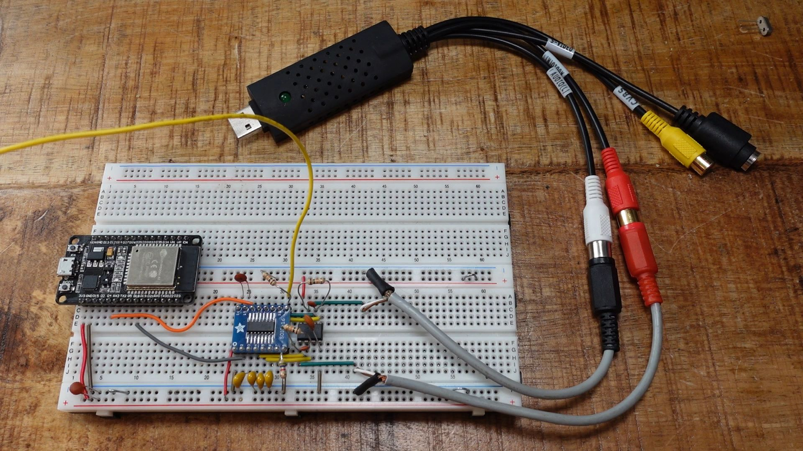

# SDR Receiver Using a Tayloe Quadrature Detector
 Simple SDR Receiver that can receive frequencies up to approximately 30MHz, if an optional Si5351 clock generator is used. Without this, it receives up to about 20MHz, using the ESP32 clock dividers. The circuit is so simple that it can even be built on a breadboard.   

 Tayloe Quadrature Detector circuit on a solderless breadboard    

 Circuit on a PCB with USB capture device connected

### What you need
- ESP32 Development Module
- The [circuit](schematic/schematic.pdf) on Breadboard or PCB
- Sound card or USB sound capture device with stereo input and a sample rate of at least 48 kbit/s.
- At least 10m or wire as an antenna
- Windows or Linux PC. A Raspberry Pi or similar board might also work, but I didn't test this.

### Arduino Libraries
- Etherkit Si5351 Arduino Library (if Si5351 is used)

### Installation
- Download and install [Quisk](https://james.ahlstrom.name/quisk/)
- Make sure that TKinter is installed. If not type `sudo apt install python3-tk`
- Configure the serial port the ESP32 is connected to in the variable *openradio_serial_port* in [.quisk_conf.py](sketch/.quisk_conf.py), i.e. `openradio_serial_port = "/dev/ttyUSB0"` on Linux or `openradio_serial_port = "COM1"` on Windows.
- On Windows: copy the script [.quisk_conf.py](sketch/.quisk_conf.py) into the "Documents" folder of your user directory and rename it to `quisk_conf.py`.
- On Linux: Copy the file into the root of your home directory
- Set `#define USE_SI5351 1` in the [ESP32 sketch](sketch/sketch.ino) if you are using an Si5351. 
- Flash it to your ESP32 dev module.
- Connect output "I" to the right channel and "Q" to the left channel of your sound card.
- Start [Quisk](https://james.ahlstrom.name/quisk/) and have fun

